# 🎵 Spotify Receipt Generator

Transform your Spotify listening history into stylish receipt designs.

## ✨ Features

- 🔐 **Spotify OAuth 2.0** - Secure authentication with PKCE flow
- 📊 **Time Ranges** - Last 4 weeks, 6 months, or all-time
- 🎨 **10 Unique Themes** - CVS, Casino, Breaking Bad, NASA, and more
- 📸 **Export Options** - PNG, JPEG, WebP up to 4K resolution
- 📱 **Responsive** - Works on all devices
- ⚡ **Live Updates** - Real-time theme and track changes

## 🎯 Live Demo

🔗 **[Try it now!](https://spotify-receipt-som.vercel.app/)**

## 🚀 Quick Start

### Prerequisites
- Node.js 18+ and npm
- Spotify account
- Spotify Developer App

### Setup

1. **Clone & Install**
```bash
git clone [your-repo-url]
cd spotify-receipt
npm install
```

2. **Configure Spotify App**

   - Visit [Spotify Developer Dashboard](https://developer.spotify.com/dashboard)
   - Create new app
   - Add redirect URI: `http://127.0.0.1:5173/callback`
   - Copy Client ID

3. **Environment Setup**
```bash
echo "VITE_SPOTIFY_CLIENT_ID=your_client_id" > .env
```

4. **Run**
```bash
npm run dev
```
Open [http://127.0.0.1:5173](http://127.0.0.1:5173)

## 📸 Screenshots

### Home Page
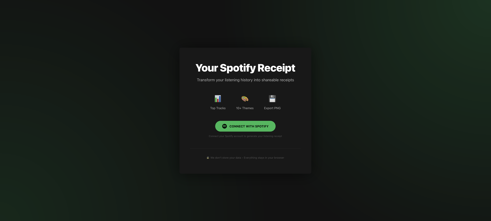
*Clean login interface with Spotify authentication*

### Receipt Examples

<table>
  <tr>
    <td>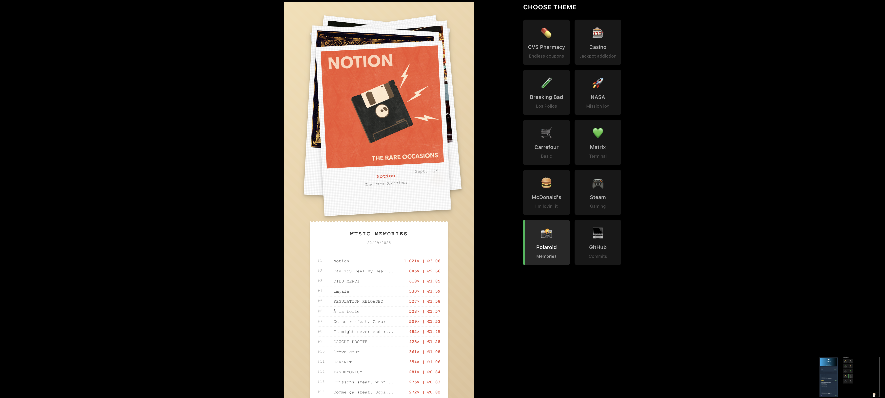</td>
    <td>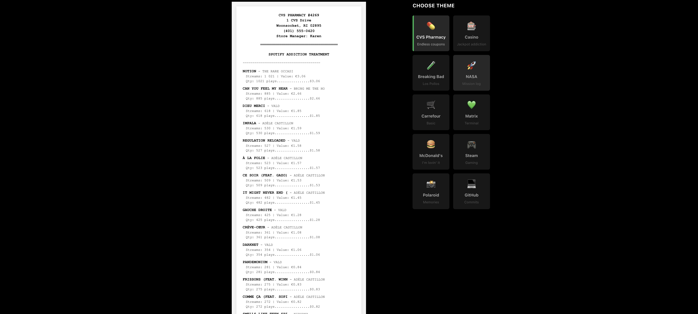</td>
  </tr>
  <tr>
    <td align="center"><b>🎞️ Polaroid</b><br>Instant photo memories</td>
    <td align="center"><b>💊 CVS</b><br>Pharmacy receipt style</td>
  </tr>
  <tr>
    <td>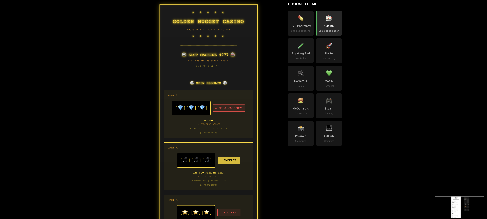</td>
    <td>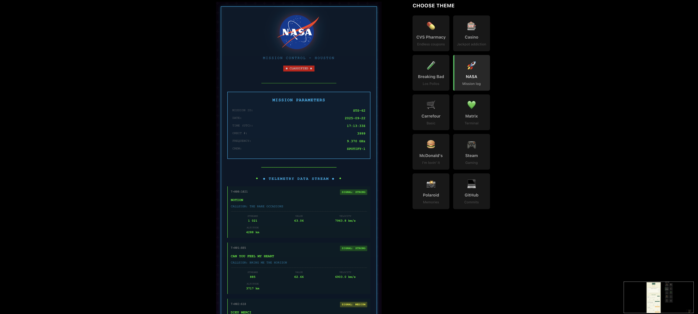</td>
  </tr>
  <tr>
    <td align="center"><b>🎰 Casino</b><br>Vegas golden ticket</td>
    <td align="center"><b>🚀 NASA</b><br>Space mission log</td>
  </tr>
  <tr>
    <td>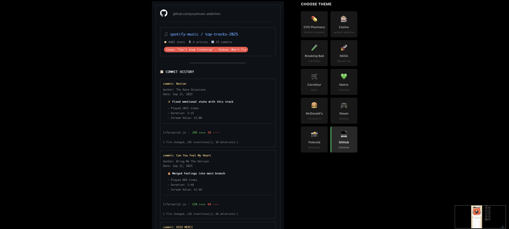</td>
    <td>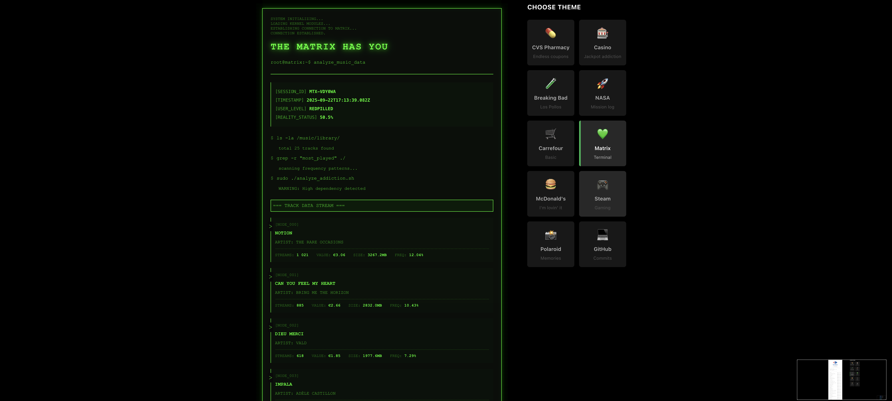</td>
  </tr>
  <tr>
    <td align="center"><b>💻 GitHub</b><br>Code contributions</td>
    <td align="center"><b>🟩 Matrix</b><br>Digital rain effect</td>
  </tr>
  <tr>
    <td>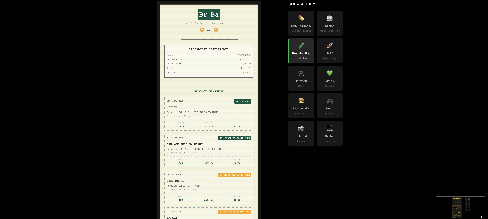</td>
    <td>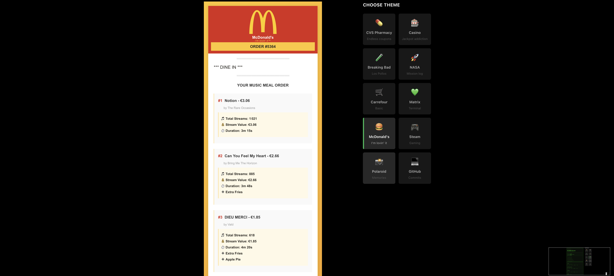</td>
  </tr>
  <tr>
    <td align="center"><b>🧪 Breaking Bad</b><br>Los Pollos Hermanos</td>
    <td align="center"><b>🍟 McDonald's</b><br>Fast food order</td>
  </tr>
  <tr>
    <td>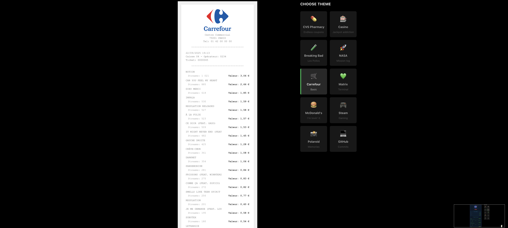</td>
    <td>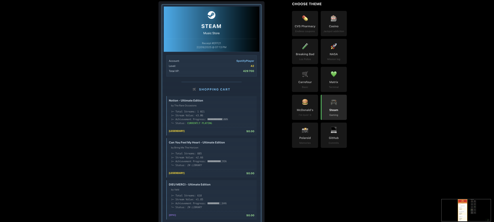</td>
  </tr>
  <tr>
    <td align="center"><b>🛒 Carrefour</b><br>French supermarket</td>
    <td align="center"><b>🎮 Gaming</b><br>Steam purchase receipt</td>
  </tr>
</table>

### Features in Action

#### 🎚️ Live Controls
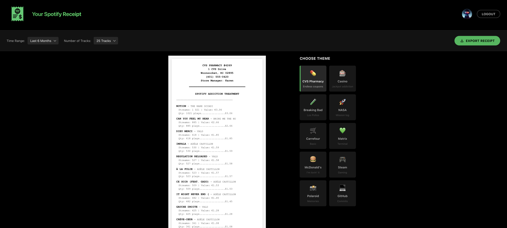
*Adjust time range, track count, and themes in real-time*

#### 💾 Export Options

*Export in multiple formats and resolutions up to 4K*

## 🎨 All Available Themes

- **CVS** - Pharmacy receipt
- **Casino** - Golden Vegas style
- **Breaking Bad** - Los Pollos Hermanos
- **NASA** - Space mission
- **Carrefour** - French supermarket
- **Matrix** - Digital rain
- **McDonald's** - Fast food order
- **Gaming** - Retro arcade
- **Polaroid** - Instant photo
- **GitHub** - Code contribution

## 📦 Scripts

```bash
npm run dev      # Development
npm run build    # Production build
npm run preview  # Preview build
```

## 🛠️ Tech Stack

- React 18 + TypeScript
- Vite
- CSS Modules
- Spotify Web API
- html2canvas


## 📄 License

MIT